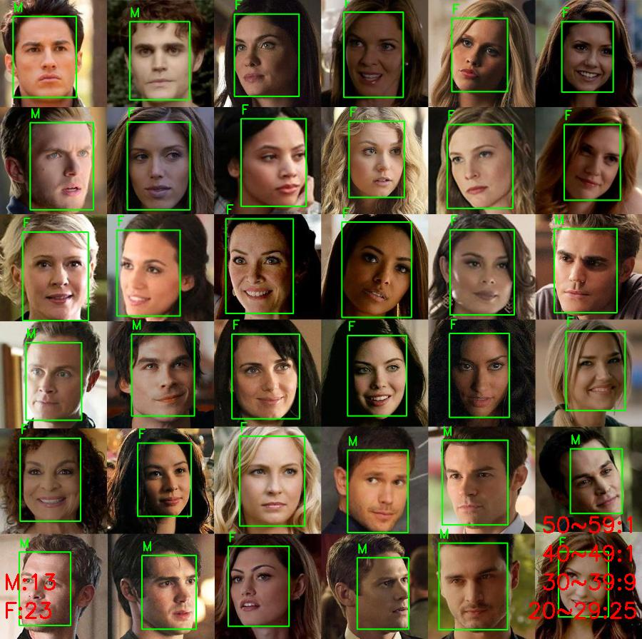
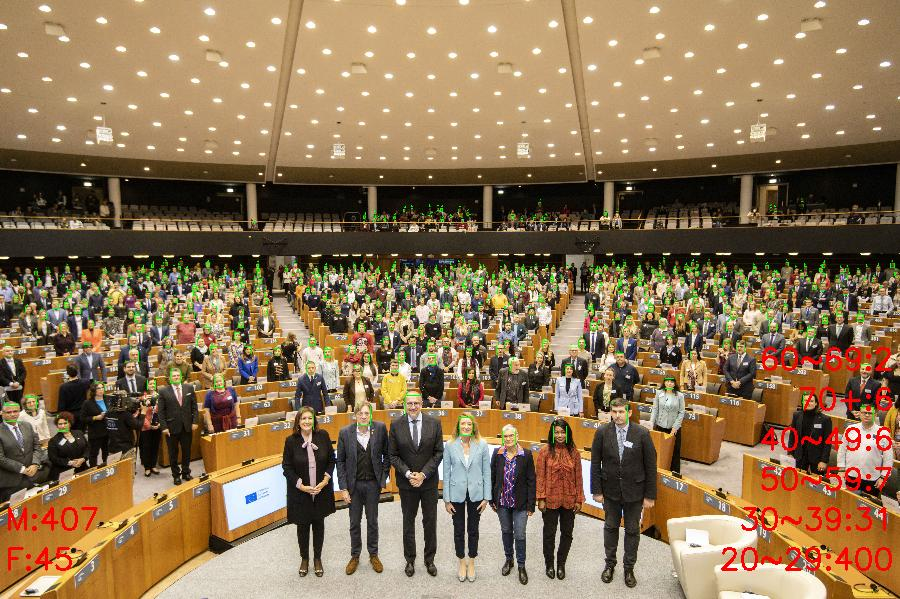

# Face Detection and Classification for Age and Gender Detection

## Project Overview
This project, developed as part of my graduation project, focuses on creating a comprehensive system for face detection and classification. The system can detect faces in images, classify them by age and gender, and store the results in a PostgreSQL database. Additionally, it includes a graphical user interface (GUI) for ease of use and provides an option to extract reports from the stored data.

## Features
- **Face Detection:** Detects faces in images using a pre-trained model.
- **Age and Gender Classification:** Classifies detected faces into age groups and gender categories.
- **Graphical User Interface (GUI):** User-friendly interface for interacting with the system.
- **Data Storage:** Stores detected and classified data in a PostgreSQL database.
- **Report Generation:** Generates reports from the stored data.

## Technologies Used
- **Programming Language:** Python
- **Face Detection Model:** YOLOV8 Faces, MTCNN
- **Age and Gender Classification Model:** YOLOV8
- **GUI Framework:** Tkinter
- **Database:** PostgreSQL
## Installation

### Prerequisites
- Python 3.x
- PostgreSQL

## Installation

1. Clone the repository:
    ```bash
    git clone https://github.com/AhmedAsh4/Age-and-Gender-Detection.git
    cd Age-and-Gender-Detection
    ```

2. Install required dependencies:
    ```bash
    pip install -r requirements.txt
    ```

## Examples

Here are some examples of the age and gender detection results:






[Data Report Example](examples/example_report.pdf)
 
